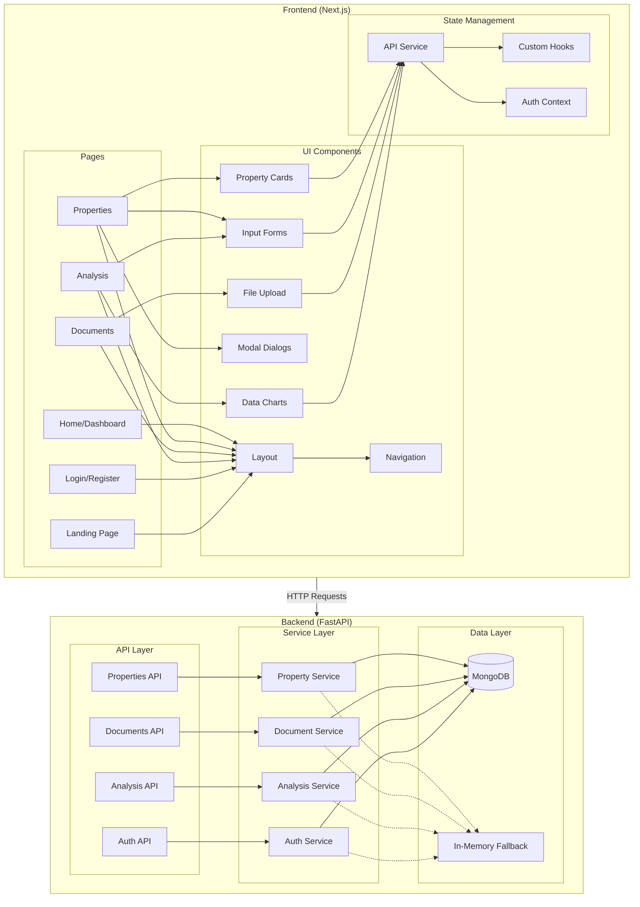
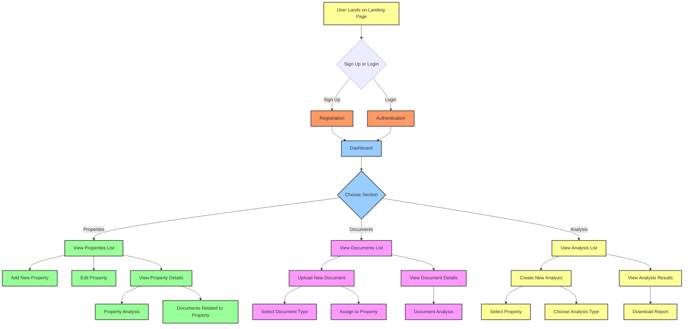

# ABARE Platform v2 - Implementation Plan

## Overview

The ABARE (AI-Based Analysis of Real Estate) Platform v2 is a simplified, focused rebuild of the original platform, designed for better maintainability, faster development, and immediate usability. The platform provides property management, document processing, financial analysis, and market data integration for commercial real estate.

### Target Audience
- Commercial Real Estate Brokers
- CRE Investors
- Lenders

### The ABARE Suite Approach
Instead of a monolithic application, ABARE will be built as a suite of interconnected applications:

1. **ABARE Core Platform** - The foundation that handles properties, basic documents, and simple analysis
2. **ABARE AI Underwriter** - AI-powered document analysis tool
3. **ABARE OM Builder** - Offering memorandum creation tool
4. **ABARE Market Data** - Treasury and SOFR tracking tools

All products will appear under the same unified platform with shared navigation, styling, and authentication, while maintaining separate codebases to avoid dependency conflicts.

## Architecture

The system uses a clean, modular architecture:

1. **Backend** - FastAPI with MongoDB
   - RESTful API endpoints
   - Authentication & authorization
   - Business logic services
   - Database access layer
   - File handling
   - In-memory database fallback for resilience

2. **Frontend** - Next.js with Mantine UI
   - Modern, responsive UI with dark theme
   - Component-based architecture
   - Client-side state management
   - API integration
   - Data visualization
   - Glass-morphism styling with cards

## System Components



## User Flow



## Implementation Timeline (2-Hour Plan)

```mermaid
gantt
    title ABARE v2 Implementation Timeline
    dateFormat  HH:mm
    axisFormat %H:%M
    
    section Setup
    Project Structure           :a1, 00:00, 10m
    Core Config Files           :a2, after a1, 10m
    
    section Backend
    Backend Models              :b1, after a2, 15m
    Database Setup              :b2, after b1, 10m
    Authentication              :b3, after b2, 15m
    Properties API              :b4, after b3, 15m
    Documents API               :b5, after b4, 15m
    
    section Frontend
    UI Components               :c1, after a2, 20m
    Authentication Pages        :c2, after c1, 15m
    Landing Page                :c3, after c2, 15m
    Dashboard Page              :c4, after c3, 15m
    Properties Pages            :c5, after c4, 20m
    
    section Integration
    Connect API & Frontend      :d1, after b5, 10m
    Testing & Fixes             :d2, after d1, 10m
```



## Technical Stack

### Backend

- **FastAPI**: Modern, high-performance web framework
- **MongoDB**: NoSQL database (with in-memory fallback option)
- **PyJWT**: JSON Web Token for authentication
- **Pydantic**: Data validation and settings management
- **Motor**: Async MongoDB driver
- **PyPDF2**: PDF processing library

### Frontend

- **Next.js**: React framework with SSR capabilities
- **Mantine UI**: Component library with dark mode support
- **Axios**: HTTP client for API requests
- **Recharts**: Composable charting library
- **React Hook Form**: Form validation

## Database Schema

### Users Collection
```typescript
{
  _id: ObjectId,
  email: String,
  hashed_password: String,
  full_name: String,
  is_active: Boolean,
  is_admin: Boolean,
  created_at: Date,
  updated_at: Date,
  last_login: Date
}
```

### Properties Collection
```typescript
{
  _id: ObjectId,
  name: String,
  property_type: String,
  property_class: String,
  year_built: Number,
  total_sf: Number,
  address: {
    street: String,
    city: String,
    state: String,
    zip_code: String,
    country: String
  },
  financial_metrics: {
    noi: Number,
    cap_rate: Number,
    occupancy_rate: Number,
    property_value: Number,
    price_per_sf: Number
  },
  status: String,
  description: String,
  features: Array<String>,
  tenants: Array<Object>,
  document_ids: Array<ObjectId>,
  created_at: Date,
  updated_at: Date
}
```

### Documents Collection
```typescript
{
  _id: ObjectId,
  filename: String,
  file_path: String,
  file_type: String,
  file_size: Number,
  status: String,
  property_id: ObjectId,
  document_type: String,
  processed_text: String,
  extracted_data: Object,
  metadata: Object,
  tags: Array<String>,
  created_at: Date,
  updated_at: Date
}
```

### Analyses Collection
```typescript
{
  _id: ObjectId,
  property_id: ObjectId,
  analysis_type: String,
  status: String,
  results: Object,
  metrics: Object,
  report_url: String,
  completed_at: Date,
  created_at: Date,
  updated_at: Date
}
```

## API Endpoints

### Authentication
- `POST /api/auth/token` - Get access token
- `POST /api/auth/register` - Register new user
- `GET /api/auth/me` - Get current user info

### Properties
- `GET /api/properties` - List all properties
- `POST /api/properties` - Create new property
- `GET /api/properties/{id}` - Get property details
- `PUT /api/properties/{id}` - Update property
- `DELETE /api/properties/{id}` - Delete property

### Documents
- `GET /api/documents` - List all documents
- `POST /api/documents/upload` - Upload document
- `GET /api/documents/{id}` - Get document details
- `PUT /api/documents/{id}` - Update document metadata
- `DELETE /api/documents/{id}` - Delete document
- `POST /api/documents/{id}/process` - Process document

### Analyses
- `GET /api/analyses` - List all analyses
- `POST /api/analyses` - Create new analysis
- `GET /api/analyses/{id}` - Get analysis details
- `PUT /api/analyses/{id}` - Update analysis
- `DELETE /api/analyses/{id}` - Delete analysis
- `POST /api/analyses/{id}/process` - Process analysis

## Frontend Pages

1. **Landing Page**
   - Hero section with headline: "ABARE - Enterprise-Grade CRE Intelligence"
   - Value proposition highlighting AI-powered real estate intelligence
   - Feature highlights and pricing tiers
   - Call-to-action for sign-up and demo

2. **Authentication**
   - Login Page
   - Registration Page

3. **Dashboard**
   - Overview statistics
   - Recent activity
   - Quick access to key features

4. **Properties**
   - Property list view
   - Property detail view
   - Add/edit property forms

5. **Documents**
   - Document list view
   - Document upload
   - Document viewer

6. **Analysis**
   - Analysis list view
   - Create analysis form
   - Analysis results view

## Landing Page Content

### Hero Section
- **Headline**: "ABARE - Enterprise-Grade CRE Intelligence"
- **Subheadline**: "Where AI Meets Real Estate Expertise"
- **CTA Button**: "Request Demo" or "Start Free Trial"

### Value Proposition
- **Main Message**: "Transform commercial real estate analysis with AI-powered intelligence that delivers institutional-grade insights in minutes, not days."
- **Key Benefits**:
  - Automated document analysis saves 10+ hours per deal
  - AI-powered risk assessment reduces investment uncertainty
  - Institutional-grade financial modeling with one click
  - Comprehensive market intelligence integrated into every analysis

### Feature Highlights
1. **AI Document Processing**
   - Automatically extract key data from rent rolls, P&Ls, and leases
   - Transform unstructured data into actionable insights
   - Validate against market benchmarks in real-time

2. **Financial Analysis Engine**
   - Comprehensive deal metrics (NOI, Cap Rate, DSCR, IRR)
   - Risk assessment with market-adjusted scoring
   - Portfolio impact analysis with concentration tracking

3. **Intelligent Dashboard**
   - Modern, intuitive interface with glass morphism design
   - Real-time property performance monitoring
   - Custom reporting with one-click generation

4. **Market Intelligence**
   - Treasury rates and SOFR spreads integration
   - Comparative market analysis for every property
   - Industry-specific risk factor assessment

### Pricing Tier Section
- **Tier 1: Analyst ($199/month)**
  - Core property analysis
  - Basic document processing (up to 25/month)
  - Single-user license
  - Standard financial calculations
  - Basic reporting
  - Email support

- **Tier 2: Professional ($499/month)**
  - Everything in Analyst, plus:
  - Advanced AI analysis
  - Document processing up to 100/month
  - Multi-user support (up to 3 users)
  - Custom reporting
  - Portfolio analysis
  - Priority support
  - API access (limited)

- **Tier 3: Enterprise ($999/month)**
  - Everything in Professional, plus:
  - Unlimited document processing
  - Unlimited users
  - White-label reporting
  - Custom AI model training
  - Dedicated support manager
  - Full API access
  - Custom integrations
  - Advanced portfolio analytics

- **Early Adopter Special**:
  - Professional tier features
  - $299/month (40% discount)
  - Locked in for 12 months
  - Free upgrade to new features
  - Direct access to development team
  - Limited to first 20 clients

## Development Process

1. **Setup Project Structure**
   - Create directory structure
   - Initialize git repository
   - Configure environment files

2. **Implement Backend**
   - Setup FastAPI application
   - Implement data models
   - Create API endpoints
   - Connect to database

3. **Implement Frontend**
   - Setup Next.js application
   - Create UI components
   - Implement pages
   - Connect to API

4. **Testing & Deployment**
   - Test API endpoints
   - Test frontend functionality
   - Deploy application

## Success Metrics

- **Functionality**: All core features work correctly
- **Performance**: Fast response times (<200ms for API)
- **Usability**: Intuitive UI with proper feedback
- **Reliability**: No critical errors during operation 